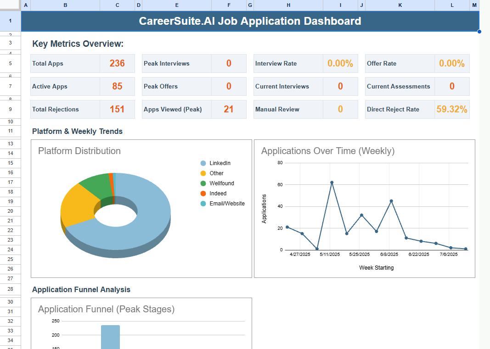

# CareerSuite.ai - Google Apps Script Backend

[](https://opensource.org/licenses/MIT)

### ➡️ [Install the CareerSuite.ai Chrome Extension from the Web Store](https://chrome.google.com/webstore/detail/careersuiteai/your-extension-id-here)

## Overview

This repository contains the complete, open-source Google Apps Script backend for the **CareerSuite.ai Chrome Extension**. This script is the engine that powers the extension's core automation features.

Designed with a **privacy-first architecture**, this backend runs exclusively within the user's own Google Account. It does not transmit, store, or process user data on any third-party or developer-owned servers. Its sole purpose is to automate the creation and management of a personal job application tracker in the user's Google Sheets by securely processing specific Gmail messages with their explicit permission.

## Our Commitment to Privacy & User Control

The architecture of this backend is guided by an unwavering commitment to user privacy, data security, and full transparency.

-   **Data Sovereignty**: You, the user, always own and control 100% of your data. All data processed by this script—including the Google Sheet tracker, the content of your emails, and your personal API key—resides exclusively within your personal Google Account.
-   **Zero Developer Data Access**: The developers of CareerSuite.ai **do not and cannot** access, collect, or store any of the user's personally identifiable information (PII), resume content, email data, or API keys. The script acts as a secure automation tool that you install and run in your own cloud environment.
-   **Full Transparency**: This project is fully open-source to allow for public auditing and independent verification of all data handling claims. We encourage you to review the code to see exactly how your data is managed.
-   **Secure Storage**: Sensitive information, such as your Google Gemini API Key, is stored using Google's own secure `PropertiesService`, which is scoped to your user account and inaccessible to the developers.

## Key Features

-   **Automated Sheet Creation**: On first authorization via the Chrome Extension, the script copies a master template to create a new "CareerSuite.ai Data" spreadsheet in the user's own Google Drive.
-   **Intelligent Email Processing**: The script creates specific labels in your Gmail (e.g., `CareerSuite.AI/Applications/To Process`). A corresponding Gmail filter, also created by the script, automatically routes relevant job application emails to this label. The script runs on an automated, hourly trigger to:
    -   Read **only** from the designated `.../To Process` label.
    -   Analyze email content to identify updates to existing applications or new applications.
    -   Update the email's label to `.../Processed` to prevent re-processing.
-   **AI-Powered Data Extraction**: To accurately parse details like Company Name, Job Title, and Application Status from unstructured emails, the script utilizes the user's provided Google Gemini API key. The key is retrieved securely from the user's account properties for each processing run.
-   **Robust Fallback Parsing**: In cases where the AI cannot be used (e.g., no API key provided), the script uses a sophisticated set of regular expressions (`ParsingUtils.js`) as a reliable fallback to extract data.
-   **Automated Dashboard & Analytics**: The script automatically populates a "Dashboard" tab in the Google Sheet, providing users with at-a-glance metrics, charts, and visualizations about their job search progress without any manual data entry.
-   **Job Leads Tracking**: A separate module allows users to forward or label job alert emails (e.g., from LinkedIn or Indeed) to be automatically parsed and added to a "Potential Job Leads" sheet.

Here's a sneak peek at the dashboard you'll get:



## Technology Stack

-   **Backend**: Google Apps Script (JavaScript ES5/V8 Runtime)
-   **Core Services**: Google Sheets API, Gmail API, Google Drive API
-   **Authentication**: Google OAuth 2.0 (handled via Web App deployment)
-   **AI Parsing**: Google Gemini API
-   **Frontend Communication**: Deployed as a Google Apps Script Web App

## System Architecture

The following diagram illustrates the data flow. All components under "User's Google Account" are created and managed by this script and are under the user's exclusive control.

```mermaid
graph TD
    subgraph User's Browser
        A[CareerSuite.ai Chrome Extension]
    end

    subgraph User's Google Account
        B[Google Apps Script Web App<br>(WebApp_Endpoints.js)]
        C[Google Apps Script Triggers<br>(Triggers.js)]
        D[Processing Engine<br>(Main.js)]
        E[Gemini Service<br>(GeminiService.js)]
        F[User's Google Sheet<br>(The Job Tracker)]
        G[User's Gmail Account]
        H[User Properties<br>(Stores API Key)]
    end

    subgraph External Services
        I[Google Gemini API]
    end

    A -- 1. Authenticated Request --> B
    B -- "2. Creates Sheet, Stores Key" --> F
    B -- " " --> H
    C -- "3. Runs Hourly" --> D
    G -- "4. Gmail Filter Labels Email" --> D
    D -- "5. Gets Email & API Key" --> G
    D -- " " --> H
    D -- "6. Sends Email Text for Parsing" --> E
    E -- "7. Makes API Call" --> I
    I -- "8. Returns Parsed JSON" --> E
    E -- "9. Returns Data to Engine" --> D
    D -- "10. Writes Data to Sheet" --> F
    D -- "11. Updates Gmail Label" --> G

    style A fill:#cce5ff,stroke:#007bff
    style B fill:#d4edda,stroke:#155724
    style C fill:#f8d7da,stroke:#721c24
    style D fill:#d1ecf1,stroke:#0c5460
    style F fill:#e2e3e5,stroke:#383d41
    style G fill:#e2e3e5,stroke:#383d41
    style H fill:#e2e3e5,stroke:#383d41
    style I fill:#fff3cd,stroke:#856404
```
1.  **Authenticated Request (User-Initiated)**: The Chrome Extension makes a secure `fetch` request to the Apps Script Web App endpoint. This is used for one-time actions like creating the sheet or saving the user's API key. This request is authenticated with the user's Google OAuth token.
2.  **Initial Setup**: The Web App (`WebApp_Endpoints.gs`) receives the request and triggers `runFullProjectInitialSetup`. This function creates the Google Sheet, sets up Gmail labels/filters, and creates the automated triggers. The user's Gemini API Key is stored securely in their account's `UserProperties`.
3.  **Automated Trigger (Time-Based)**: An hourly trigger (`Triggers.js`) automatically executes the main processing function in `Main.js`.
4.  **Email Processing**: The script checks a specific Gmail label (`.../To Process`) for new emails.
5.  **Secure Key Retrieval**: The script retrieves the user's Gemini API key from their secure `UserProperties`.
6.  **AI Analysis**: The `GeminiService.gs` module sends the text of a relevant email to the Google Gemini API for parsing.
7.  **Data Persistence**: The script writes the parsed data (e.g., Company Name, Job Title) into the user's private Google Sheet.
8.  **State Management**: To prevent duplicate processing, the script modifies the email's label from `.../To Process` to `.../Processed`.

## Project File Structure

*   `Main.js`: The central orchestration file. Contains the `onOpen()` function to create the spreadsheet menu (e.g., "Finalize Project Setup", "Process Application Emails"), the primary `runFullProjectInitialSetup()` function, and the main email processing engine.
*   `WebApp_Endpoints.gs`: Handles all incoming HTTP `doGet` and `doPost` requests from the companion Chrome Extension. This is the primary entry point for the extension to communicate with the backend.
*   `Config.gs`: A centralized configuration file containing all global constants, such as sheet names, column headers, status types, AI model endpoints, and Gmail label names.
*   `GeminiService.gs`: Manages all interactions with the Google Gemini API. It constructs the prompts, sends the requests for email parsing, and handles the responses.
*   `SheetUtils.gs`: A collection of utility functions for interacting with Google Sheets, including creating new sheets, applying formatting, and managing data ranges.
*   `GmailUtils.gs`: Contains helper functions for interacting with Gmail, primarily for creating and managing labels (`getOrCreateLabel`).
*   `Leads_Main.gs`: Contains the primary functions for the Job Leads Tracker module, including initial setup of the leads sheet/labels/filters and the ongoing processing of job lead emails.
*   `Leads_SheetUtils.gs`: Contains utility functions specifically for the "Potential Job Leads" sheet, such as writing new job data, retrieving processed email IDs, and mapping column headers.
*   `Dashboard.gs`: Manages the creation, formatting, and data population of the "Dashboard" and "DashboardHelperData" sheets, including chart creation and formula setup.
*   `ParsingUtils.gs`: Contains functions dedicated to parsing email content (subject, body, sender) using regular expressions and keyword matching as a fallback or supplement to AI parsing.
*   `Triggers.gs`: Includes functions for creating, verifying, and managing the time-driven triggers that automate the script's execution (e.g., checking for new emails every hour).
*   `AdminUtils.gs`: Provides utility functions for project setup and configuration, such as managing API keys stored in `UserProperties`.
*   `appsscript.json`: The project's manifest file. It defines the necessary OAuth scopes (permissions), time zone, and dependencies on advanced Google services required for the script to function.

## Getting Started / Installation

This script is designed to be deployed automatically by the **CareerSuite.ai Chrome Extension**. Manual setup is not required for end-users.

For developers, security auditors, or users who wish to deploy this backend manually:

1.  **Create a standalone Google Apps Script Project**: Navigate to [script.google.com](https://script.google.com) and create a new project.
2.  **Copy Code**: Copy the code from each `.js` and the `appsscript.json` file in this repository into your Apps Script project. Ensure all filenames match exactly.
3.  **Create a Template Sheet**: Create a new Google Sheet. This will be your master template. Format it with the required tabs and headers as defined in `Config.js` (`APP_TRACKER_SHEET_TAB_NAME`, `DASHBOARD_TAB_NAME`, etc.).
4.  **Configure the Script**: Open the `Config.js` file in the Apps Script editor and update the `TEMPLATE_SHEET_ID` constant with the ID of the template sheet you just created.
5.  **Enable Advanced Google Services**: In the editor, click on **Services (+)**. Find and add the **Gmail API**.
6.  **Run Initial Setup on Template (Optional but Recommended)**: To prepare the template with necessary formatting and hidden columns, you can temporarily set the spreadsheet ID in your browser to the template's ID and run `userDrivenFullSetup()` from the script editor. **Remember to remove any dummy data before saving the template.**
7.  **Deploy as a Web App**:
    *   Click the **Deploy** button > **New deployment**.
    *   Select type **Web app**.
    *   Configure the deployment:
        *   **Execute as**: `User accessing the web app`
        *   **Who has access**: `Anyone`
    *   Click **Deploy**. You will be prompted to authorize the script's permissions.
    *   Copy the generated **Web app URL**. This is the endpoint your fork of the Chrome Extension will need.

## Troubleshooting

*   **Emails are not being processed automatically:**
    1.  Ensure the hourly trigger is active. In your spreadsheet, go to **Extensions > Apps Script**. In the Apps Script editor, click the **Triggers (alarm clock) icon**. You should see a trigger for `processEmails_triggerHandler` running every hour. If not, run the setup from the menu again.
    2.  Check if the Gmail filter is working. Find an email that should have been processed and see if it has the `CareerSuite.AI/Applications/To Process` label.

*   **I encountered an error during setup or processing:**
    *   You can view detailed logs of the script's activity. In your spreadsheet, go to **Extensions > Apps Script**, then click the **Executions (play list) icon**. Find any failed executions (marked in red) and click on them to view the logs.

## Permissions & Scopes Justification

This script operates on a principle of **least privilege** and requires specific permissions to function on the user's behalf within their own account. The permissions you grant during the one-time authorization are essential for the script's core functionality.

Here is the justification for each sensitive OAuth scope requested in `appsscript.json`:

*   `https://www.googleapis.com/auth/drive`:
    *   **Reason**: This permission is required **only** during the initial setup to copy the master template and create the "CareerSuite.ai Data" spreadsheet in the user's personal Google Drive. After this one-time action, it is used to find the sheet by its name if the script loses track of its ID.

*   `https://www.googleapis.com/auth/spreadsheets`:
    *   **Reason**: This is the primary scope for the script's main function. It is necessary to write the parsed job application data into the user's "CareerSuite.ai Data" spreadsheet, update the dashboard, and read existing entries to avoid duplicates.

*   `https://www.googleapis.com/auth/gmail.readonly`:
    *   **Reason**: This scope is used to read the content (subject, sender, body) of emails that have been explicitly filtered into the `CareerSuite.AI/Applications/To Process` label. The script **does not** read from the general inbox or any other label.

*   `https://www.googleapis.com/auth/gmail.labels`:
    *   **Reason**: This is required for the script to create the `CareerSuite.AI/...` label structure and to modify an email's labels after processing (e.g., changing from `To Process` to `Processed`). This is critical for state management and preventing infinite loops.

*   `https://www.googleapis.com/auth/gmail.modify`:
    *   **Reason**: While `gmail.labels` covers most label operations, `gmail.modify` is sometimes required by the underlying Gmail API to reliably remove one label and add another in a single operation on a thread. It is used exclusively for managing the `To Process` and `Processed` labels on threads the script is actively handling.

*   `https://www.googleapis.com/auth/gmail.settings.basic`:
    *   **Reason**: This permission is required to programmatically create the Gmail filter that automatically routes relevant job application emails to the `.../To Process` label. This is a core part of the automation that saves the user from manually labeling emails.

*   `https://www.googleapis.com/auth/script.external_request`:
    *   **Reason**: This scope is necessary for the `GeminiService.gs` module to make an API call to the Google Gemini API endpoint (`https://generativelanguage.googleapis.com/...`). This is how the AI-powered parsing is achieved.

For a complete overview of our data practices, please see our full [Privacy Policy](https://careersuiteai.vercel.app/privacy).

## Contributing

Contributions are welcome! If you have suggestions for improvements or find a bug, please feel free to open an issue or submit a pull request.

## License

This project is licensed under the MIT License. See the [LICENSE](LICENSE) file for details.
